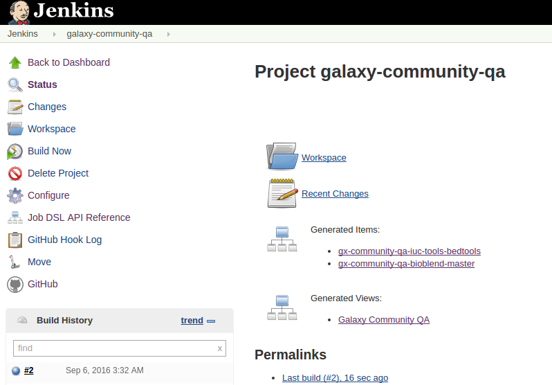
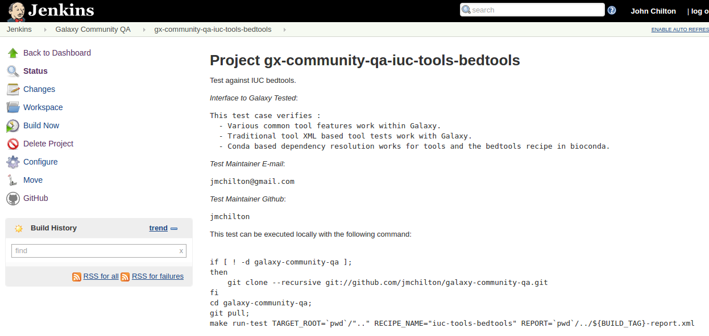

# Galaxy Community Automated Quality Assurance Tests

This project is in its early stages - so the structure of tests and the project 
itself will change greatly over the coming months.

The project is meant to provide some formal support for diverse community QA 
efforts. Galaxy has a plethora of platform testing in the core project - but there 
are things that are inappropriate to include there - such as testing specific 
workflows and tools, testing an external project's interface into Galaxy (such as
bioblend or planemo), and testing with frameworks or languages that Galaxy doesn't 
currently support (such as selenium).

## Overview

When Jenkins is configured as described below, each recipe in this repository will
become a Jenkins job. Jobs for these recipes will be linked to the job for this
repository:



In addition to jobs for each of these recipes, a new Jenkins view will be created
containing all of these jobs:


Each resulting job will be run against Galaxy daily and the will display job metadata -
such as who is reposible for maintaining the job and the interface of Galaxy being tested.




## Project Structure

 - ``recipes/`` Each of these recipes is a test definition - they can be configured
   in Jenkins or run manually using ``Makefile``.
 - ``just-dockerfiles/`` This contains the "framework" for testing and should be
   independent of Galaxy. This directory is a git submodule pointing at the framework
   at https://github.com/jmchilton/just-dockerfiles.
 - ``just-dockerfiles.json`` Is the configuration file that configures Galaxy and  
   this project's test recipes to just-dockerfiles.

## Local Testing

The example bioblend test recipe can be executed using:

```
TARGET_ROOT=/home/john/workspace/galaxy make run-test RECIPE_NAME=bioblend-master
```

## Configuring Jenkins

Jenkins can be configured to build one job per test recipe using the following procedure:

 - Install Jenkins and Python on the build box (or farm) if these have not been
   installed already.
 - Install the [jobs-dsl](https://wiki.jenkins-ci.org/display/JENKINS/Job+DSL+Plugin)
   and [Github](https://wiki.jenkins-ci.org/display/JENKINS/GitHub+Plugin) plugins.
 - Setup a freestyle project to point at this project's Github repository.
 - Under Git:
   - Specify this repository as "Repository URL": git@github.com:jmchilton/galaxy-community-qa.git
   - Under additional behaviors, select "Advanced sub-modules behaviors" and then
     " Recursively update submodules"
 - Add a "Build Step" to this Jenkins project for "Process Job DSLs"
 - Choose "Look on Filesystem" for this step and enter the script path 
   ``just-dockerfiles/buildjobs.groovy``.
 - Save and execute the job - this should create jobs for each recipe in this repository
   and view collecting them all.
